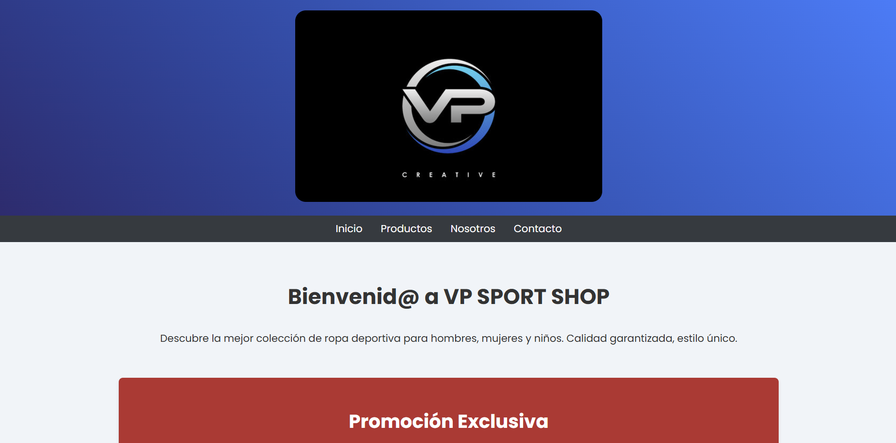

# 🌐 WEB de una Tienda de Ropa

## 📖 Descripción
  
> Página web diseñada como práctica de **Lenguaje de Marcas** en el ciclo **DAM**. Incluye estructura básica en HTML y estilos personalizados con CSS.

---

## 🚀 Tecnologías utilizadas
- **HTML5**: Estructura del contenido
- **CSS3**: Estilos y diseño

---

## 🎨 Vista previa

🔗 [Ver Demo](https://vpweb.github.io/Sport-Shop-test-page/)

